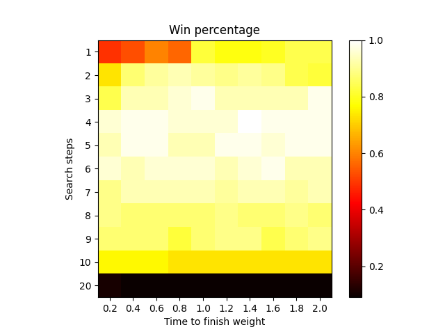
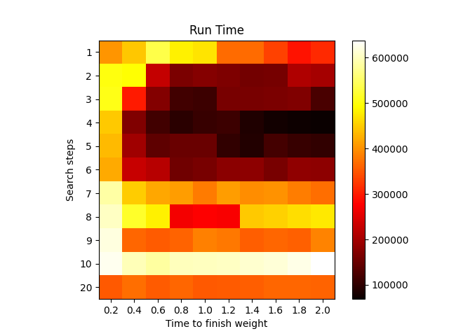
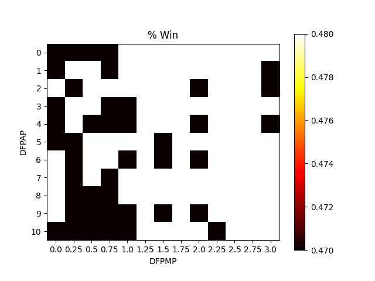
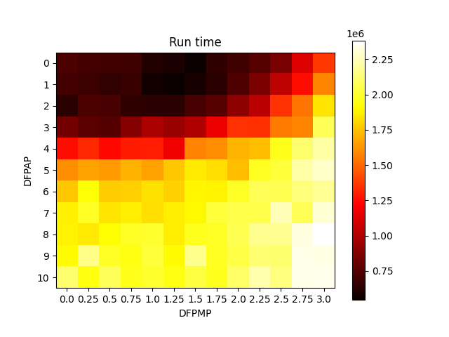
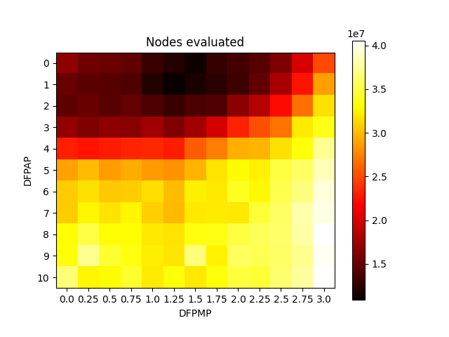
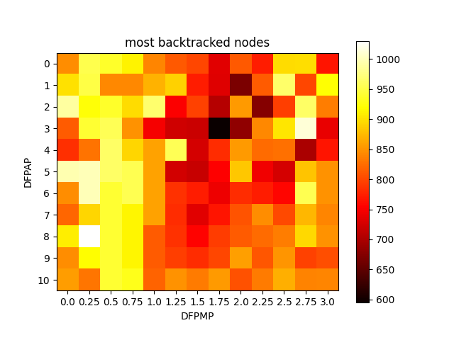

# RESULTS

## COMMON TASK

V tomto úkolu jsme měnili SEARCH_STEPS (1, 2, ..., 10, 20) a TIME_TO_FINNISH_WEIGHT(0.2, 0.4, ..., 2.0).

Win Percentages             |  Run Time
:-------------------------:|:-------------------------:
|

Z grafů výše si můžeme všimnout, že šance na výhru je nepřímo úměrná času běhu.

Dále vidíme, že při `SEARCH_STEPS=20` agent téměř nevyhrává. Moje hypotéza je, že agent měl problém s navigací a tedy umřel na většině úrovní.

## ELECTIVE TASK - Polynomiální penalizace při odchodu od cesty

Parametry:
 - NODE_DEPTH_WEIGHT = 1
 - SEARCH_STEPS = 4 *(zvoleno podle Common Task)*
 - DISTANCE_FROM_PATH_TOLERANCE = 0
 - DISTANCE_FROM_PATH_ADDITIVE_PENALTY = (0, 1, ..., 10)
 - DISTANCE_FROM_PATH_MULTIPLICATIVE_PENALTY = (0, 0.25, ..., 3)

Celkem 143 kombinací parametrů.

Hodnota penalizace: vzdálenost od cesty * DFPMP ^ 2 + DFPAP ^ 2 + DFPAP

### Výsledky

Volba parametrů neměla skoro žádný vliv na šanci na výhru.

Zajímavější je ale průběh běhu. Podívejme se na celkový čas. Nejkratší čas vidíme u DFPMP = 1.5 a DFPAP = 0. S rostoucí vzdáleností od tohoto bodu pak narůstá čas.

Dále vidíme spojitost mezi počtem projitých uzlů a časem stráveným na výpočtu.

Pokud se podíváme, při jakých parametrech byl největší backtracking, pak to vypadá, že největší backtracking byl při DFPMP=0.5.

