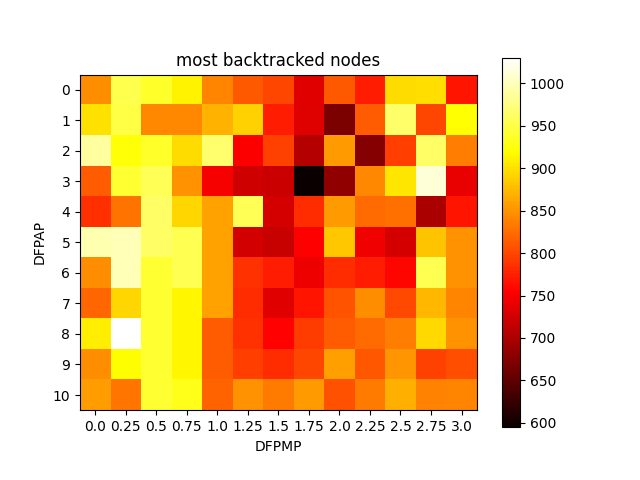
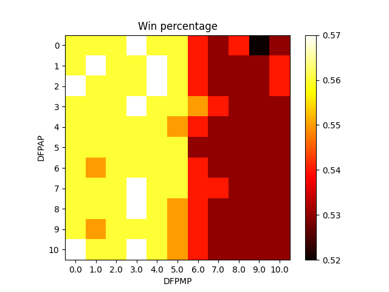
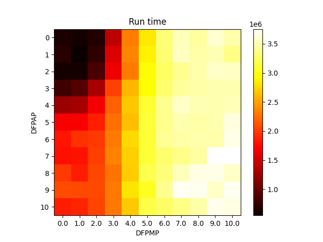

# RESULTS

## COMMON TASK

V tomto úkolu jsme měnili SEARCH_STEPS (1, 2, ..., 10, 20) a TIME_TO_FINNISH_WEIGHT(0.2, 0.4, ..., 2.0).

Win Percentages             |  Run Time
:-------------------------:|:-------------------------:
|

Z grafů výše si můžeme všimnout, že šance na výhru je nepřímo úměrná času běhu.

`SEARCH_STEPS = 4`  se zdá jako optimální hodnotou, jelikož při nižších hodnotách trávil agent hodně času na přemýšlení a při vyšších vznikala chybovost kvůli přeskakování herních tiků.

Dále vidíme, že při `SEARCH_STEPS=20` agent téměř nevyhrává. Moje hypotéza je, že agent měl problém s navigací a tedy umřel na většině úrovní.

## ELECTIVE TASK - Polynomiální penalizace při odchodu od cesty - astarGrid

### První pokus

Parametry:
 - NODE_DEPTH_WEIGHT = 1
 - SEARCH_STEPS = 4 *(zvoleno podle Common Task)*
 - DISTANCE_FROM_PATH_TOLERANCE = 0
 - DISTANCE_FROM_PATH_ADDITIVE_PENALTY = (0, 1, ..., 10)
 - DISTANCE_FROM_PATH_MULTIPLICATIVE_PENALTY = (0, 0.25, ..., 3)

Celkem 143 kombinací parametrů.

Hodnota penalizace: `vzdálenost od cesty * DFPMP ^ 2 + DFPAP ^ 2 + DFPAP`

Volba parametrů neměla skoro žádný vliv na šanci na výhru. Je možné, že při větším rozdílu hodnot by byl rozdíl výher větší.
Konkrétně by mohlo mít smysl zvýšit hodnoty DFPMP, protože v rostoucím směru je rostoucí šance na výhru.

Zajímavější je ale průběh běhu. Podívejme se na celkový čas. Nejkratší čas vidíme u DFPMP = 1.25 a DFPAP = 1. S rostoucí vzdáleností od tohoto bodu pak narůstá čas.
Při nízkých hodnotách DFPMP a DFPAP má agent větší volnost při prohledávání, může jít dál od cesty.

Dále vidíme spojitost mezi počtem projitých uzlů a časem stráveným na výpočtu.

Pokud se podíváme, při jakých parametrech byl největší backtracking, pak to vypadá, že největší backtracking byl při DFPMP=0.5.

Další pohled na šanci na výhru a backtracking může ukazovat jistou spojitost mezi těmito hodnotami, konkrétně nepřímou úměrnost.
Jelikož je rozdíl u procenta výher tak nízký, může toto pozorování být chybné.

### Druhý pokus

Parametry:
 - NODE_DEPTH_WEIGHT = 1
 - SEARCH_STEPS = 4 *(zvoleno podle Common Task)*
 - DISTANCE_FROM_PATH_TOLERANCE = 0
 - DISTANCE_FROM_PATH_ADDITIVE_PENALTY = (0, 1, ..., 10)
 - DISTANCE_FROM_PATH_MULTIPLICATIVE_PENALTY = (0, 1, ..., 10)

Celkem 121 kombinací parametrů.

Všimněme si, že se zvyšující se cenou DFPMP se snižuje šance na výhru. Moje hypotéza je, že agent nemá takovou volnost a odejít z cesty je pro něj velice drahé, zdánlivě dražší než smrt.

Délka běhu je v souladu s výsledky z prvního pokusu. Se zvyšující se cenou za opuštění cesty se zvyšují výpočetní nároky. Moje hypotéza je že překážka v cestě může silně zkazit výpočet cesty.

Zde vidíme zdánlivě náhodné hodnoty. Hodnoty jsou zdánlivě v souladu s dělkou běhu, ale jelikož se jedná o maxima, nemusí být tyto hodnoty reprezentativní.

