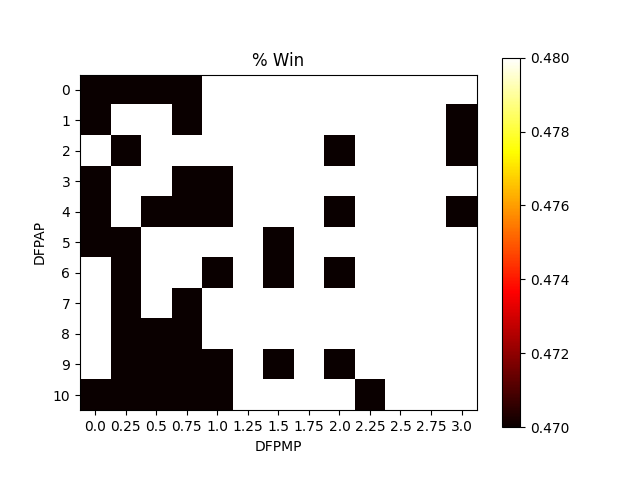
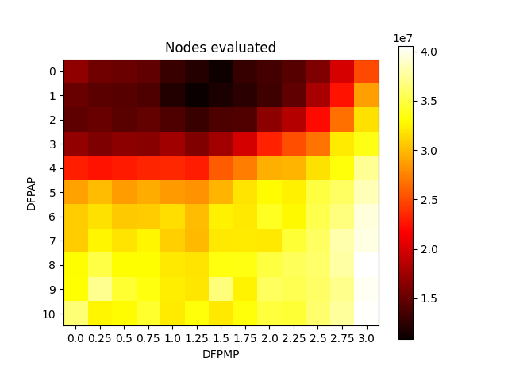
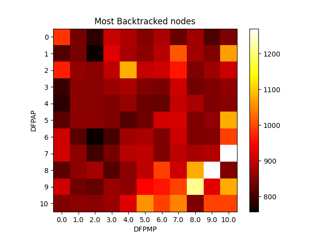

# RESULTS

## COMMON TASK

In this task we have changed SEARCH_STEPS (1, 2, ..., 10, 20) and TIME_TO_FINNISH_WEIGHT (0.2, 0.4, ..., 2.0).

Win Percentages             |  Run Time
:-------------------------:|:-------------------------:
|

We may notice win rate is inversly proportional to run time.

`SEARCH_STEPS = 4` seems to be optimal as the agent isn't thinking too much or skipping important ticks.

We may also notice that at `SEARCH_STEPS=20` agent almost never wins. This could be caused by problematic navigation when skipping ticks in search tree.

## ELECTIVE TASK - Polynomial penalty when leaving path - astarGrid

### First attempt

Params:
 - NODE_DEPTH_WEIGHT = 1
 - SEARCH_STEPS = 4 *(chosen via common task)*
 - DISTANCE_FROM_PATH_TOLERANCE = 0
 - DISTANCE_FROM_PATH_ADDITIVE_PENALTY = (0, 1, ..., 10)
 - DISTANCE_FROM_PATH_MULTIPLICATIVE_PENALTY = (0, 0.25, ..., 3)

In total: 143 parameter combinations.

Penalty calculation: `distance * DFPMP ^ 2 + DFPAP ^ 2 + DFPAP`

Choice of parameters had almost no impact on winrate as differences in DFPMP and DFPAP are small.

Given the graph bellow we may notice that given more expensive costs, the run time increases.

Number of visited nodes goes hand in hand with run time.

Looking at backtracking and win rate, there can be a connection. As more backtracking could mean more mistakes in searches.

### Second attempt

Parametry:
 - NODE_DEPTH_WEIGHT = 1
 - SEARCH_STEPS = 4 *(chosen via common task)*
 - DISTANCE_FROM_PATH_TOLERANCE = 0
 - DISTANCE_FROM_PATH_ADDITIVE_PENALTY = (0, 1, ..., 10)
 - DISTANCE_FROM_PATH_MULTIPLICATIVE_PENALTY = (0, 1, ..., 10)

In total: 121 parameter combinations.

Let's point out that the winrate is higher given lower DFPMPs. This could be because there is an obstacle agent cannot get across or the search does not allow them to get off of the path.

Run time is in keeping with the first attempt.

Here we have seemingly random results. As the values are maximums, they may not be representative of agents thinking.

